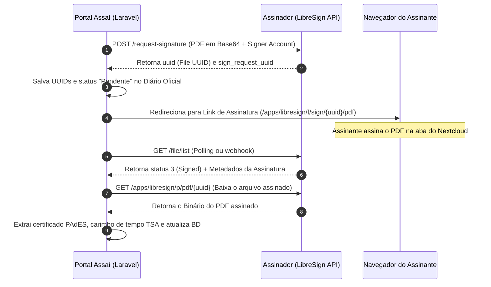

# Integração Prática e Técnica da API REST do Assinador (LibreSign)

Esta documentação detalha de forma técnica e aprofundada como a API REST do **Assina Assaí (LibreSign/Nextcloud)** foi implementada e integrada na prática no portal de Diários Oficiais do Município de Assaí.

---

## 1. Arquitetura de Comunicação e Autenticação

A integração foi desenvolvida utilizando a **REST API** do LibreSign sobre a especificação do protocolo **OCS (Open Collaboration Services)** do Nextcloud.

### Endpoint Base e Headers
* **URL de Produção:** `https://assinador.assai.pr.gov.br/ocs/v2.php/apps/libresign/api/v1`
* **Headers Obrigatórios:**
  * `OCS-APIRequest: true` (Evita bloqueios de CSRF no Nextcloud)
  * `Accept: application/json`
  * `Content-Type: application/json`

### Esquema de Autenticação Dinâmica (Multi-Tenant)
Para garantir máxima segurança e rastreabilidade, as chamadas não utilizam uma única credencial mestre. Em vez disso, o [LibreSignService](file:///app/Services/LibreSignService.php) resolve as credenciais dinamicamente com base no usuário autenticado no Laravel:

```php
private function resolveCredentials(): void
{
    $user = auth()->user();

    if ($user && !empty($user->libresign_username)) {
        $this->username      = $user->libresign_username;
        $this->signerAccount = $user->libresign_signer_account ?? $user->email;
        $this->password      = Crypt::decryptString($user->libresign_password);
    } else {
        // Fallback para credenciais globais do .env
        $this->username      = config('services.libresign.username');
        $this->password      = config('services.libresign.password');
        $this->signerAccount = config('services.libresign.signer');
    }
}
```

As senhas de aplicativo (App Passwords) dos usuários são armazenadas de forma criptografada no banco de dados local utilizando a função de encriptação simétrica do Laravel (`AES-256-CBC` via `Crypt::encryptString`).

---

## 2. Fluxo Prático de Assinatura (Passo a Passo)



### Passo 1: Solicitação de Assinatura (`POST /request-signature`)

O documento PDF gerado localmente pelo Portal é codificado em **Base64** e enviado no payload da requisição.

**Endpoint:** `POST /request-signature`  
**Payload enviado:**
```json
{
  "name": "DIARIO_OFICIAL_EDICAO_102_2026.pdf",
  "file": {
    "url": "data:application/pdf;base64,JVBERi0xLjQKJ..."
  },
  "signers": [
    {
      "identifyMethods": [
        {
          "method": "account",
          "value": "jorginho",
          "mandatory": 1
        }
      ]
    }
  ]
}
```

**Tratamento de Resposta e Auto-Healing:**
A resposta do LibreSign retorna um envelope OCS complexo. O serviço extrai o `uuid` (identificador do arquivo) e o `sign_request_uuid` (identificador da sessão de assinatura):

```php
$data = $response->json();
$uuid = $data['ocs']['data']['uuid'] ?? $data['ocs']['data']['data']['uuid'] ?? null;
$signRequestUuid = $this->findKeyInArray($data, 'sign_request_uuid');
```

> [!NOTE]
> **Mecanismo de Auto-Healing:** Se o `sign_request_uuid` não for retornado diretamente na resposta de envio (devido a instabilidades de rede ou payloads assíncronos), o serviço faz uma requisição imediata de contingência a `/file/list` com o `uuid` para recuperar o identificador da sessão, garantindo integridade das chaves primárias.

---

### Passo 2: Redirecionamento do Usuário

Após persistir o status como `pendente` e registrar os UUIDs no banco de dados, o Portal redireciona o assinante para o painel de assinatura interativo do LibreSign:

```
https://assinador.assai.pr.gov.br/apps/libresign/f/sign/{uuid}/pdf
```

Neste painel, o assinante autentica seu certificado, define o posicionamento visual da assinatura e conclui o ato jurídico.

---

### Passo 3: Verificação de Status e Obtenção de Metadados (`GET /file/list`)

Para atualizar o status do diário oficial e descobrir se a assinatura foi concluída, o Portal faz consultas periódicas (Polling) ou recebe atualizações por callback:

**Endpoint:** `GET /file/list`  
**Query Params:** `uuid={uuid}&details=1`

**Processamento dos Status do LibreSign:**
A API retorna um código inteiro que representa a situação atual do documento:
* `0` = Não definido
* `1` = Pronto para assinar
* `2` = Parcialmente assinado (em fluxos com mais de um assinante)
* `3` = **Assinado (Concluído)**
* `4` = Excluído

**Filtragem de Retornos:**
Devido ao design do protocolo OCS do Nextcloud, o endpoint `/file/list` pode retornar um array de múltiplos arquivos ou um objeto único. O [LibreSignService](file:///app/Services/LibreSignService.php) aplica uma busca recursiva inteligente para localizar o payload exato do documento consultado:

```php
$allDocs = $data['ocs']['data']['data'] ?? [];
$fileData = null;

if (is_array($allDocs) && isset($allDocs[0])) {
    foreach ($allDocs as $doc) {
        if (($doc['uuid'] ?? '') === $uuid) {
            $fileData = $doc;
            break;
        }
    }
}
```

---

### Passo 4: Download Seguro do PDF Assinado (`GET /apps/libresign/p/pdf/{uuid}`)

Quando o documento é marcado com status `3` (Assinado), o Portal deve obter a cópia definitiva do arquivo PDF assinado (conforme as especificações PAdES).

> [!CAUTION]
> **Evitando Erro HTTP 422:** O endpoint padrão `/apps/libresign/pdf/{sign_request_uuid}` dispara erro HTTP 422 caso o arquivo já tenha sido finalizado e assinado. Para contornar essa regra de negócio do LibreSign, o Portal baixa o PDF assinado diretamente da rota pública de documentos finalizados:
> 
> `GET https://assinador.assai.pr.gov.br/apps/libresign/p/pdf/{file_uuid}`

O arquivo recebido é validado por assinatura binária (`%PDF`) e salvo de forma estruturada no Storage local do portal:

```php
Storage::disk('public')->put('atos_oficiais/diarios/assinados/diario_oficial_edicao_X_assinado.pdf', $pdfBinary);
```

---

## 3. Alinhamento de Fuso Horário e Fusos Localizados

O servidor Nextcloud/LibreSign gera os metadados de assinatura no padrão de hora universal (UTC). Para atender às normas de publicação oficial do município, os metadados extraídos pelo Portal são convertidos em tempo real para o fuso horário oficial de Brasília:

```php
$carimboDataHora = null;
$rawCarimbo = $signerData['signed_date'] ?? null;

if ($rawCarimbo) {
    // Converte a hora UTC do Nextcloud para o fuso horário local de Assaí/PR
    $carimboDataHora = \Carbon\Carbon::parse($rawCarimbo)->timezone('America/Sao_Paulo');
}
```

Isso garante que, por exemplo, um documento assinado às `01:48h UTC` do dia `11/05` seja corretamente exibido ao cidadão como `22:48h` do dia `10/05` (Fuso horário local -03:00).

---

## 4. Segurança de Dados e Conformidade com a LGPD

O sistema foi estruturado para proteger dados pessoais sensíveis dos servidores municipais, em total sintonia com as diretrizes da **Lei Geral de Proteção de Dados (LGPD)**.

### Higienização e Sanitização do CPF (SQLSTATE[22001])
Para evitar falhas na persistência do PostgreSQL em colunas de tamanho fixo (limite de 11 caracteres), todos os CPFs recebidos nos formulários de criação e callbacks da API são sanitizados, eliminando caracteres especiais e mantendo estritamente os **11 caracteres numéricos**:

```php
$assinanteCpf = preg_replace('/\D/', '', $cpfInput);
```

### Máscara de Exibição Pública
No Portal público, o CPF do responsável pela publicação nunca é exposto integralmente. Em vez disso, é aplicada uma máscara parcial de segurança:

```php
// Transforma "12345678901" em "***.456.789-**"
$cleanCpf = preg_replace('/\D/', '', $diario->assinante_cpf);
$maskedCpf = '***.' . substr($cleanCpf, 3, 3) . '.' . substr($cleanCpf, 6, 3) . '-**';
```

---

## 5. Tratamento de Resiliência de Conexão e Timeout

Em conexões de longa distância ou com servidores governamentais, podem ocorrer timeouts de rede (**cURL Error 28**). O Portal configura parâmetros defensivos em todas as requisições HTTP:

* **Connection Timeout:** `10 segundos` (tempo máximo para estabelecer handshake).
* **Request Timeout:** `30 segundos` para metadados e até `120 segundos` para download de PDFs grandes.
* **Mecanismo de Retentativa (Retry):** Tentativa automática de reenvio de pacotes perdidos caso a primeira chamada falhe por erro de tráfego.

```php
$response = Http::withBasicAuth($this->username, $this->password)
    ->withHeaders(['OCS-APIRequest' => 'true'])
    ->connectTimeout(10)
    ->timeout(30)
    ->retry(2, 1000) // Tenta novamente 2 vezes, com intervalo de 1s
    ->post($url, $payload);
```

---

## 6. Referência de Banco de Dados (Portal Assaí)

As seguintes colunas controlam as chaves e metadados no modelo [DiarioOficial](file:///app/Models/DiarioOficial.php):

| Coluna | Tipo | Descrição |
| :--- | :--- | :--- |
| `libresign_uuid` | `string` | ID único do arquivo PDF no servidor de assinaturas. |
| `libresign_sign_request_uuid` | `string` | ID de rastreamento da sessão de assinatura. |
| `assinatura_status` | `string` | Situação local (`pendente`, `assinado`, `erro`). |
| `assinante_cpf` | `string(11)` | CPF higienizado do assinante real (vinculado via conta local). |
| `assinante_cargo` | `string` | Cargo público do responsável pela assinatura (Ex: *Prefeito*). |
| `carimbo_data_hora` | `timestamp` | Data e Hora exatas do carimbo de tempo da assinatura (fuso local). |
| `pdf_assinado_url` | `string` | Link público gerado para validação direta do PDF no LibreSign. |

---
*Divisão de Ciência, Tecnologia e Inovação — Portal Assaí*  
*Assaí/PR — 2026*
